## Tarea 4 Ventanas(Prompt)

#### Ejercicio 1:

Realizar un script que pregunte: ¿Está seguro de que quiere hacer esto?

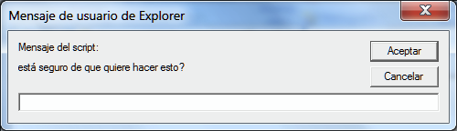

Si el usuario introduce texto se visualizará el mismo. En este caso el usuario introdujo “Sí”.

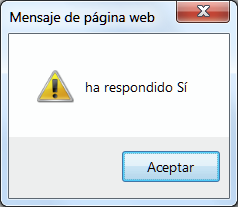

Si pulsa Cancelar aparecerá el mensaje “Ha rehusado contestar”.

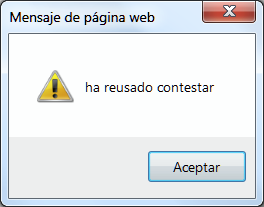

Recuerda que cuando pulsamos Cancelar, el resultado que devuelve el prompt a la variable es null.

Si una variable no está vacía, cuando hagamos un if devolverá true, si está vacía devolverá false. Por ejemplo:

var prueba = 8;
if (prueba) { 
    alert (“la variable contiene algo”);
}

Hacer if(prueba), sin poner ninguna condición más, es algo así como preguntar ¿hay algo en la
variable prueba? Como en este caso la variable contiene el número 8 se confirma que hay algo,
por lo tanto, la condición es true y el alert mostrará el mensaje. Si hubiese pasado lo siguiente:
var prueba=”” (cadena vacía) no se mostraría el mensaje.

#### Ejercicio 2

Vamos a realizar un script que nos diga si un material flota o se hunde dependiendo de su densidad medida en gr/cm3.

El script, como ayuda al usuario, mostrará ejemplos de distintas densidades y realizará la pregunta “Qué densidad tiene el material elegido”:

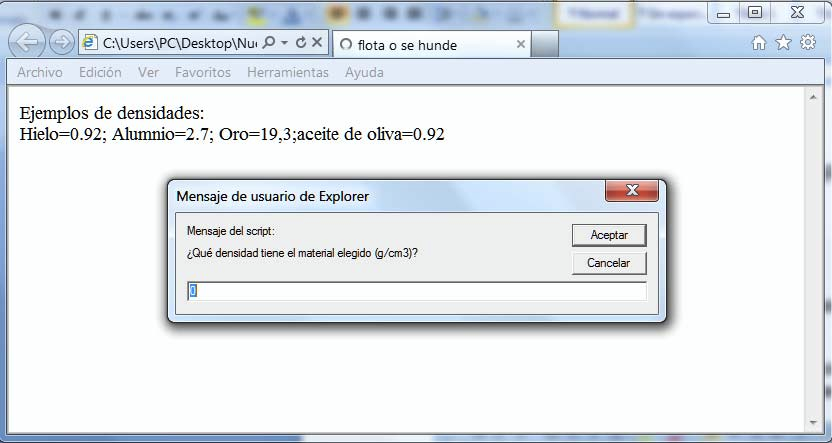

Si la densidad es menor de 1 el material flotará, si es mayor se hundirá, mostrando las siguientes alertas según sea el caso:

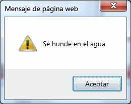 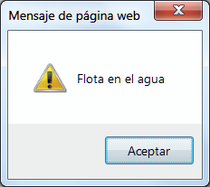

#### Ejercicio 3

El script nos pedirá el radio y la altura de un cilindro y mostrará su volumen.
La fórmula es:  .V=PI * r * r * h
(Puedes usar el valor 3.14 para la constante PI )

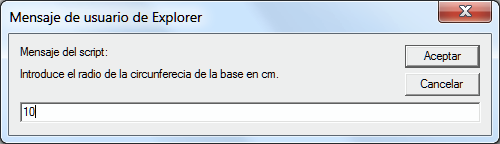
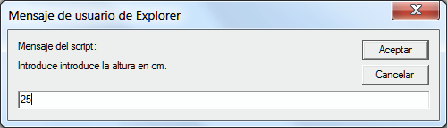

Por fin, nos mostrará el resultado:

Nota:
prompt siempre nos devuelve una cadena de caracteres y no un número. Hay varios métodos para convertir la cadena en número cuando nos interese. Uno de los más sencillos es multiplicar *1. Ejemplo:
numero1=prompt("Introduce el primer número",0)*1 De esa forma, numero1 será un número y podremos operar con él.

Respecto al número PI, ponemos calcular el valor de forma más exacta siguiendo el siguiente ejemplo aplicado a la obtención de la longitud de una circunferencia:
L=2*Math.PI*r 
Esta sería la formula para hallar dicha longitud, en donde “L” sería la longitud y “r” el radio.
Math lo veremos más delante de forma más amplia.

#### Ejercicio 4

Vamos a realizar un script que nos pregunte el nombre y la edad. Nos responderá con un saludo y nos dirá si somos menores o mayores de edad y los días que hemos vivido.

El script, en primer lugar nos hará dos preguntas

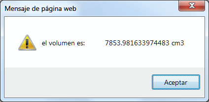
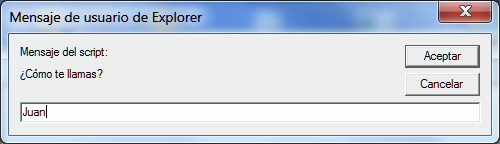

Observa que la respuesta se muestra en dos filas diferentes, en la primera está el nombre y en la siguiente el resto:

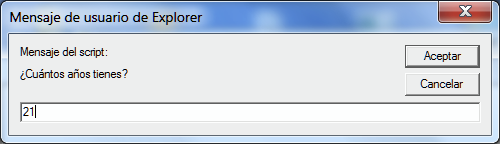
