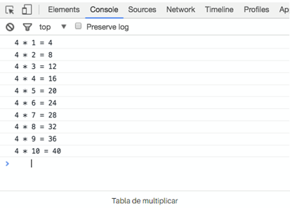

## Tarea 5 Ejercicios Varios

#### Ejercicio 1:

Muestre a través de la consola si el número introducido en una caja de texto es par o impar. 
Usar el archivo parImpar.html (este archivo está incompleto).

#### Ejercicio 2:

Recorre mediante for-in una variable llamada texto que representa a la cadena “ejemplo”.
¿Qué resultados obtenemos al ejecutar?¿Qué conclusión podemos extraer?

https://www.w3schools.com/jsref/jsref_forin.asp

#### Ejercicio 3:

Crear un bucle desde 1 hasta 500 donde se muestre en consola únicamente los números múltiplos de 3 y 
el  número de números que no son primos. Nota: Aplicar modulo (%)

#### Ejercicio 4:

Ejecutar el código del archivo calificación.html y evaluar los valores obtenidos. 

¿Qué calificación obtenemos cuando la nota introducida es 5? Y ¿Cuándo es 9? ¿y 2?. 
Usar el archivo calificación.html subido al AulaVirtual.

#### Ejercicio 5:

Escribe un programa que muestre por pantalla una tabla de multiplicar, sumar y dividir. 
En primer lugar se le pedirá al usuario que introduzca un número entre 2 y 10.
Si el número no está entre estos dos valores, se le seguirá pidiendo hasta que introduzca el valor correcto.
Mostrará la tablas de multiplicar, sumar y dividir, utilizando los tres tipos de bucles que hay en JavaScript 
(para cada tabla, un tipo de bucle diferente).

Se mostrará por consola la tablas con un formato parecido al siguiente.

#### Ejercicio 6:

Escribe un programa que pida al usuario un día de la semana y que muestre por consola el día siguiente. 
Si se introduce un valor que no corresponda a un día de la semana, se le mostrará un mensaje al usuario.

#### Ejercicio 7:

Sabiendo que cuando desplazamos 1 bit a la derecha, dividimos un entero por 2 y cuando lo desplazamos 
a la izquierda estamos multiplicando por 2. Desarrolla una aplicación que imprima el resultado de las 
siguientes operaciones empleando desplazamiento de bits:

125 / 8 = 
40 x 4 =
25 / 2 =
10 x 16 =

